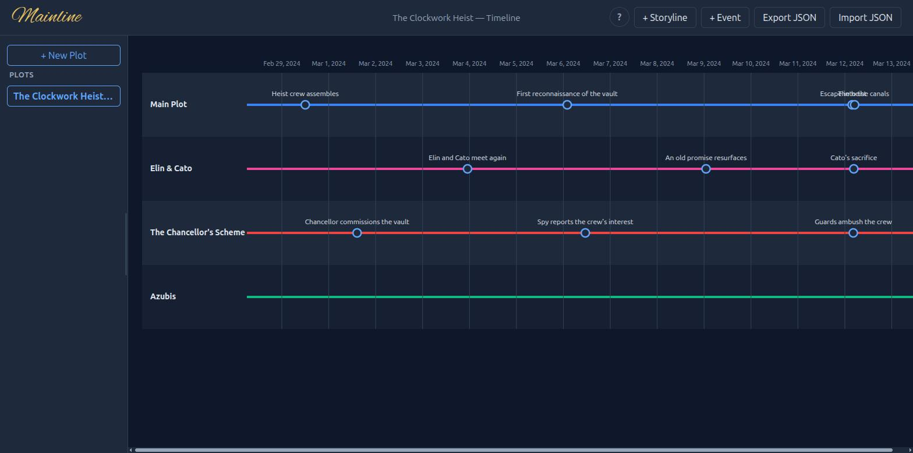

# Mainline

Mainline is a client-side web app for book authors to lay out their
storylines as **swimlanes** and plot **events** — each with a date and
time — along a shared timeline. It's meant to make it easy to see, at a
glance, how a main plot and its subplots interleave in time across a whole
manuscript.

**Live demo**: https://dbraun1991.github.io/Mainline/

> Called Storylane through early development; renamed to avoid a naming
> collision with an unrelated, unaffiliated product already live on the
> web. Hosted on GitHub as `Mainline`, matching the current name — see
> the dev URL and build config below.

Visualized in the spirit of a metro-map renderer (lines on a shared axis),
but purpose-built for storylines that stay on their own lane rather than
lines that share and cross track — see [ADR-0002](docs/adr/0002-swimlane-visualization.md)
for why the visualization approach differs. A storyline can still fork
from a specific event on another (a subplot spinning out of the main
plot), but never merges back or crosses another lane's track — see
[ADR-0014](docs/adr/0014-branching-storylines.md).



## What it does

- Create any number of **storylines** (swimlanes), each with a name and
  color.
- Add **events** to a storyline: a title, date, optional time, and
  optional description — via a header button, or by clicking directly on a
  storyline's line at roughly the right point in time.
- See all storylines rendered as horizontal lanes on one shared time axis,
  with events plotted at their date/time. Hover an event for its full
  date/time, storyline, and description.
- Click a lane label to edit or delete that storyline; click an event to
  edit or delete it.
- Fork a new storyline off a specific event on another one — pick the
  storyline, then which of its events, and the fork's date/time and origin
  follow automatically. Deleting a storyline that others fork from
  detaches them (they become independent) rather than deleting them too.
- Hold any number of **plots** side by side in a resizable sidebar and
  switch between them with a click — each one autosaves independently.
- Autosaves to the browser's local storage; **Export JSON**/**Import JSON**
  move a plot between devices or into version control.
- Ask an LLM to convert a manuscript/outline into an importable plot —
  [`docs/llm-import-dsl.md`](docs/llm-import-dsl.md) is a self-contained
  spec for it to follow, no separate tool required.
- Click the header's **?** button for an in-app "How Mainline works"
  overlay covering all of the above.

## Development

```
npm install
npm run dev      # starts the Vite dev server, http://localhost:5173/Mainline/
npm run build    # production build to dist/
npm run preview  # serve that build locally
```

Requires Node.js (any current LTS).

**Deployment**: every push to `main` auto-deploys to GitHub Pages via
`.github/workflows/deploy-pages.yml` (ADR-0006), once Pages is enabled in
the repo's settings (Settings → Pages → Source: GitHub Actions).
`vite.config.js`'s `base: '/Mainline/'` matches Pages' project-site
subpath (ADR-0016).

## Project data

Each plot is a single JSON document — `storylines` + `events`, events
referencing their storyline by id. See
[ADR-0003](docs/adr/0003-data-model.md) for the full shape, and
[`public/data/example.json`](public/data/example.json) for a worked
example (a short heist story with three interleaving storylines). The
sidebar (ADR-0007) can hold any number of these at once.

## Architecture Decisions

See [`docs/adr/`](docs/adr/README.md) for the full, numbered decision log.
Highlights:

| ADR | Decision |
|-----|----------|
| [0001](docs/adr/0001-frontend-build-tooling-vite.md) | npm + Vite |
| [0002](docs/adr/0002-swimlane-visualization.md) | SVG swimlanes on a shared linear time axis |
| [0003](docs/adr/0003-data-model.md) | One JSON document: `storylines` + `events` |
| [0004](docs/adr/0004-persistence.md) | localStorage autosave + manual JSON export/import |
| [0005](docs/adr/0005-vanilla-js-no-framework.md) | Vanilla JS/HTML/CSS, no reactive framework |
| [0006](docs/adr/0006-static-hosting-github-pages.md) | GitHub Pages via GitHub Actions |
| [0007](docs/adr/0007-multi-plot-sidebar.md) | Multi-plot sidebar: a plot store + a persistent list-style switcher |
| [0008](docs/adr/0008-event-tooltip.md) | Event tooltip: a custom HTML card, not native SVG `<title>` |
| [0009](docs/adr/0009-sidebar-resize-handle.md) | Plot sidebar: drag-to-resize handle |
| [0010](docs/adr/0010-uuid-ids.md) | Ids: RFC 4122 UUIDs via `crypto.randomUUID()`, kept prefixed |
| [0011](docs/adr/0011-llm-import-dsl.md) | LLM import path: a self-contained doc, not an in-app DSL parser |
| [0012](docs/adr/0012-wordmark-font.md) | Wordmark font: self-hosted open-source webfont, imported from CSS |
| [0013](docs/adr/0013-click-line-event-creation.md) | Click-line-then-node: a second, pre-filled entry point into event creation |
| [0014](docs/adr/0014-branching-storylines.md) | Branching storylines: a fork tree, snapshot-anchored to an event, not independent lanes only |
| [0015](docs/adr/0015-two-step-fork-picker.md) | "Forks from" picker: two steps (storyline, then event), not one flat list |
| [0016](docs/adr/0016-github-repo-name-mainline.md) | GitHub repo name: `Mainline`, correcting the `storylane-local` base-path assumption |

## What it does NOT do (yet)

- No merging storylines back together — forking only, one direction.
- No git-backed history/undo beyond re-importing an earlier export.
- No handling for densely clustered events on the same lane beyond letting
  their labels overlap.
- No backend — fully client-side.
